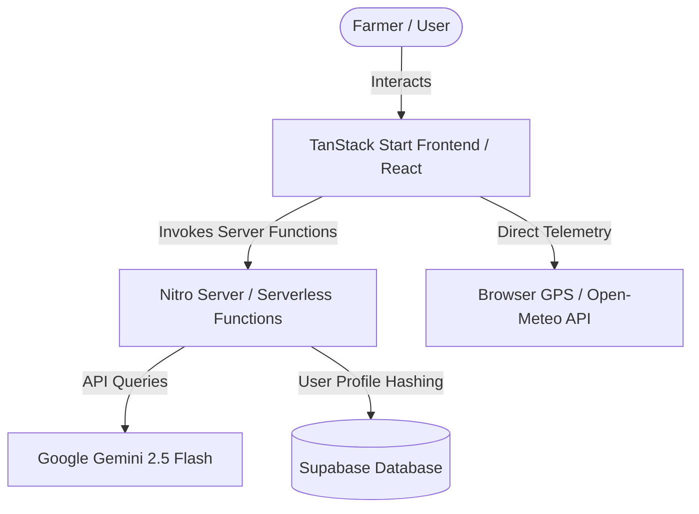
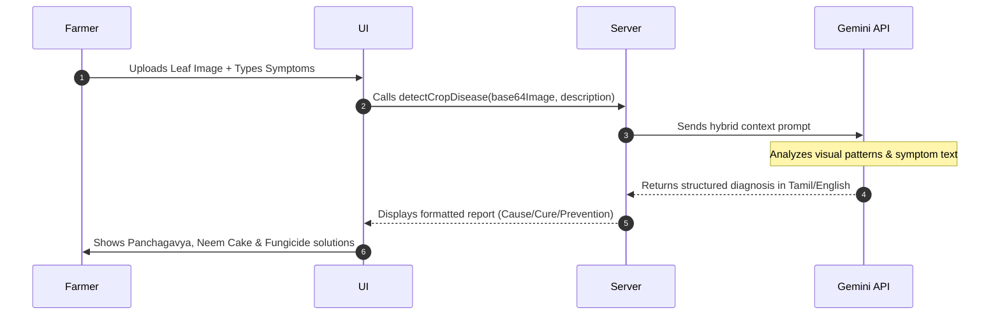

# 🌿 AgriVerse Project Presentation Deck

This presentation deck outlines the **AgriVerse** platform. It contains the problem statement, solution overview, features, technical architecture, and system workflows.

---

## 📽️ Slides Outline

### Slide 1: Cover Page
* **Title**: AgriVerse
* **Subtitle**: Smart AI Agriculture Suite for Tamil Nadu Farmers
* **Developer**: mathishankar2710
* **Core Vision**: Bridging the gap between cutting-edge AI and regional agricultural practices to maximize crop yield, optimize costs, and predict market prices.
* **Scope**: A comprehensive system featuring Disease Diagnostics, Price Forecasting, Weather Telemetry, IoT Motor Control, and an AI Chatbot.

---

### Slide 2: The Problem Statement (Farmer Challenges)
* **Market Price Volatility**: Farmers struggle to know the optimal selling window, often selling crops at a loss due to middlemen and supply spikes.
* **Crop Pathology & Late Detection**: Visual symptoms of crop diseases are misidentified or detected too late, leading to total harvest failures.
* **Complex Language Barriers**: Existing AI tools use English or Hindi terminology that does not resonate with Tamil Nadu / regional farming nomenclature.
* **Fragmented Agricultural Utilities**: Farmers have to use separate tools for weather forecast, NPK fertilizer calculation, and disease lookup.

---

### Slide 3: The Solution
* **Regional Localization**: Custom default weather tracking (Coimbatore region) and Tamil script translations (e.g., *Nel (நெல்)*, *Manjal (மஞ்சள்)*).
* **Instant Disease Scanning**: Upload leaf photos or describe symptoms in plain text to get rapid, bulleted diagnostics containing cause and cure instructions.
* **Local Remedies**: Solution reports prescribe specific medicines (fungicides) alongside regional organic inputs (e.g., *Panchagavya*, *neem cake manure*, and *vermicompost*).
* **AI Price Analytics**: Price forecasting charts populated with standard Tamil Nadu crops (Sugarcane, Banana, Mango, Groundnut, etc.) to estimate the best sales windows.

---

### Slide 4: Feature Focus — Disease Detection System
* **Flexible Input Methods**:
  * **Text Only**: Type in crop symptoms (e.g., "yellow leaf edges") to request AI diagnostics.
  * **Image Only**: Drag-and-drop crop leaf photos directly into the scanner.
  * **Hybrid Input**: Provide both leaf image and text context for higher diagnostic accuracy.
* **Agronomy Remedies Output**:
  * Outputs only strict structured blocks: *Disease Name*, *How it comes*, *Solution to clear this*, *How to prevent*.
  * Integrates regional Tamil Nadu solutions like **Panchagavya** & **neem cake** next to modern fungicides.

---

### Slide 5: Feature Focus — Crop Price Prediction System
* **Crops Covered**: Locals crop rates including Turmeric (Manjal), Coconut (Thengai), Cotton (Paruthi), Rice (Nel), Tapioca (Maravalli), Sugarcane (Karumbu), Banana (Vazhai), Mango (Maambazham), Groundnut (Kadalai), Maize (Cholam), Chilli (Milagai).
* **Regional Market Mandis**: Integrated pricing parameters aligned with Erode, Coimbatore, Tiruppur, Salem, Trichy, and Krishnagiri.
* **Supply Shift Simulator**: Interactive input simulating expected crop yield changes (+/- %) to chart future price trends automatically using responsive line charts.

---

### Slide 6: Feature Focus — AI Smart Farming Assistant Chatbot
* **Interactive Chat**: Built-in agricultural expert bot for querying fertilizer calculations, sowing dates, and pesticide schedules.
* **Tamil script translations**: Automatically appends Tamil translation in parentheses next to crop, botanical, and pest names (e.g. *Paddy (நெல்)*), preventing Hindi translation outputs.
* **Smart Prompt Chips**: Easy one-click suggestions for rapid farming diagnostics.
* **Bulleted Output**: Information structured neatly using clean bold headings and checklists rather than long essays.

---

### Slide 7: Feature Focus — Weather Forecast & IoT Controls
* **Auto-Geolocation**: Prompts for browser GPS location permission immediately on mount to load accurate local forecasts.
* **Fallback Defaults**: Automatically loads Coimbatore weather telemetry if location access is blocked.
* **Interactive Map**: Allows selecting any coordinates globally directly from the map widget to pull local weather forecasts.
* **Smart Motor Status**: Simulated IoT control panel displaying live Motor ON/OFF status toggles.

---

### Slide 8: Feature Focus — Secure Authentication & Profiles
* **Secure Registration**: Incorporates double-validation fields including username, email, password, and confirm-password checks.
* **SubtleCrypto SHA-256 Hashing**: Passwords are secure hashed client-side inside the browser before transfer, preventing plain-text visibility in transport.
* **Supabase Synced Profiles**: User profile info is synchronized instantly into a secure PostgreSQL `profiles` database table on signup.

---

### Slide 9: Technical Architecture
* **Frontend**: React + Vite + TailwindCSS for premium aesthetics.
* **Backend Server**: TanStack Start Server Functions running on a Vinxi/Nitro engine.
* **Database**: Supabase PostgreSQL (stores hashed login profiles client-side via SHA-256).
* **AI Engine**: Gemini 2.5 Flash API for vision and text completion.

---

### Slide 10: System Workflows





---

### Slide 11: Setup & Local Run Guide
* **Local Run (Docker)**:
  ```bash
  docker compose build
  docker compose up -d
  ```
  App starts at `http://localhost:3001`.
* **GitHub Repository**:
  `https://github.com/mathishankar2710/AgriVerse.git`
* **Vercel Deploy Config**:
  * **Build Command**: `npm run build`
  * **Output Directory**: `.vercel/output`
  * **Environment Variables**: Add `GEMINI_API_KEY`, `VITE_SUPABASE_URL`, and `VITE_SUPABASE_ANON_KEY`.
