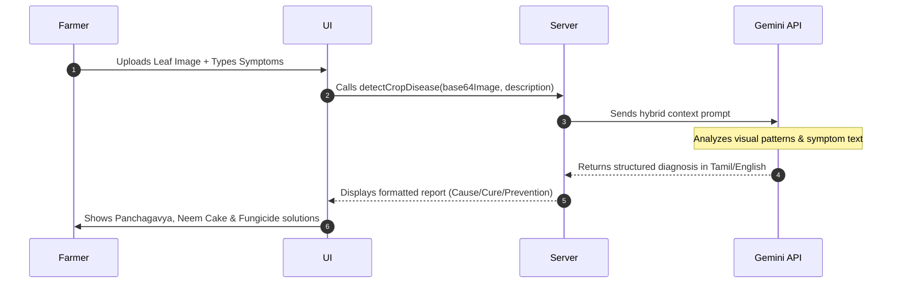

# 🌿 AgriVerse Project Presentation Deck

This presentation deck outlines the **AgriVerse** platform. It contains the problem statement, solution overview, features, technical architecture, and system workflows.

---

## 📽️ Slides Outline

### Slide 1: Cover Page
* **Title**: AgriVerse
* **Subtitle**: Smart AI Agriculture Suite for Tamil Nadu Farmers
* **Developer**: mathishankar2710
* **Core Vision**: Bridging the gap between cutting-edge AI and regional agricultural practices to maximize crop yield, optimize costs, and predict market prices.
* **Scope**: A comprehensive system featuring Disease Diagnostics, Price Forecasting, Weather Telemetry, IoT Motor Control, and an AI Chatbot.

---

### Slide 2: The Problem Statement (Farmer Challenges)
* **Market Price Volatility**: Farmers struggle to know the optimal selling window, often selling crops at a loss due to middlemen and supply spikes.
* **Crop Pathology & Late Detection**: Visual symptoms of crop diseases are misidentified or detected too late, leading to total harvest failures.
* **Complex Language Barriers**: Existing AI tools use English or Hindi terminology that does not resonate with Tamil Nadu / regional farming nomenclature.
* **Fragmented Agricultural Utilities**: Farmers have to use separate tools for weather forecast, NPK fertilizer calculation, and disease lookup.

---

### Slide 3: The Solution
* **Regional Localization**: Custom default weather tracking (Coimbatore/Kongu region) and Tamil script translations (e.g., *Nel (நெல்)*, *Manjal (மஞ்சள்)*).
* **Instant Disease Scanning**: Upload leaf photos or describe symptoms in plain text to get rapid, bulleted diagnostics containing cause and cure instructions.
* **Local Remedies**: Solution reports prescribe specific medicines (fungicides) alongside regional organic inputs (e.g., *Panchagavya*, *neem cake manure*, and *vermicompost*).
* **AI Price Analytics**: Price forecasting charts populated with standard Tamil Nadu crops (Sugarcane, Banana, Mango, Groundnut, etc.) to estimate the best sales windows.

---

### Slide 4: Features & Functionalities
1. **Disease Detection System**:
   * Accepts **only images**, **only text descriptions**, or **both combined**.
   * Outputs strict categories: *Disease Name*, *How it comes*, *Solution to clear this*, *How to prevent*.
2. **Crop Price Prediction**:
   * Interactive chart tracking prices (₹/quintal) over 10 months.
   * "Expected Supply Shift" slider simulating yield spikes/shortfalls.
3. **AI Agronomist Chatbot**:
   * Smart suggestion chips for rapid farming queries.
   * Auto-translates crop/pest terms to Tamil.
4. **IoT pump switch & Geolocation Weather Dashboard**.

---

### Slide 5: Technical Architecture
* **Frontend**: React + Vite + TailwindCSS for premium aesthetics.
* **Backend Server**: TanStack Start Server Functions running on a Vinxi/Nitro engine.
* **Database**: Supabase PostgreSQL (stores hashed login profiles client-side via SHA-256).
* **AI Engine**: Gemini 2.5 Flash API for vision and text completion.

---

### Slide 6: System Workflows




---

### Slide 7: Setup & Local Run Guide
* **Local Run (Docker)**:
  ```bash
  docker compose build
  docker compose up -d
  ```
  App starts at `http://localhost:3001`.
* **GitHub Repository**:
  `https://github.com/mathishankar2710/AgriVerse.git`
* **Vercel Deploy Config**:
  * **Build Command**: `npm run build`
  * **Output Directory**: `.vercel/output`
  * **Environment Variables**: Add `GEMINI_API_KEY`, `VITE_SUPABASE_URL`, and `VITE_SUPABASE_ANON_KEY`.
